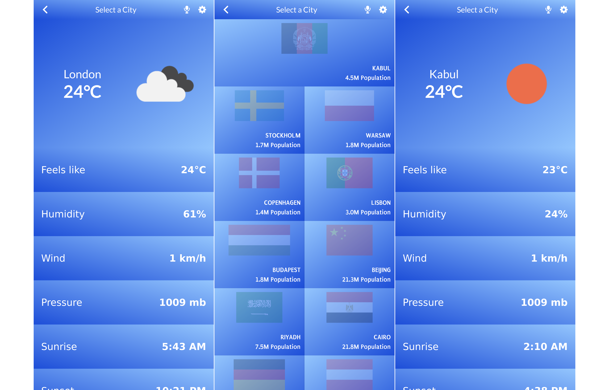

# React Temperature 

 This React application is a simple tool which provides the weather data in Celsius units for the capital cities of some countries, with a flag and population on the homescreen. This application gets data from the [Open Weather Map](https://openweathermap.org/api) API.

## Screenshot

## Built With

- React
- Redux
- React Router
- Tailwind CSS
- Framer Motion
- Webpack
- Jest and React testing library (for testing)

## Live Demo

- [Live Demo Link](https://dev--astonishing-vacherin-c3ff6b.netlify.app/)

## Getting Started

To get a local copy up and running follow these simple steps:

### Prerequisites

Open your terminal and navigate to the folder you would like to save the project.

### Setup

Type these commands into the terminal:

- `git clone git@github.com:aimalamiri/React-Temperature.git` 
- `cd React-Temperature`

You will need a .env file before you install and run the project. There is included an example file .env.example

- `cp .env.example .env` (if you are using Linux or macOS)
- If you work on Windows, you can use this command in Git Bash.

> Note: You'll need to create an API key on the [Open Weather Map](https://openweathermap.org/api) and use it on `.env` file

### Install

Type this command into the terminal:

- `npm install`

### Build

Type these commands into the terminal:

- npm run build

### Run the local server

Type these commands into the terminal:

- `npm run start`
- Your web browser will open on localhost:3000

### Run tests

Type this command into the terminal:

- `npm run test`

## Authors

👤 **Aimal Amiri**

- GitHub: [@aimalamiri](https://github.com/aimalamiri)
- Twitter: [@meaimal](https://twitter.com/meaimal)
- LinkedIn: [Aimal Amiri](https://linkedin.com/in/aimal-amiri)

## 🤝 Contributing

Contributions, issues, and feature requests are welcome!

Feel free to check the [issues page](../../issues/).

## Show your support

Give a ⭐️ if you like this project!

## Acknowledgments

- [Open Weather Map](https://openweathermap.org/api) for the API 
- Original design idea by [Ballhead](https://www.behance.net/gallery/31579789/Ballhead-App-(Free-PSDs))
## 📝 License

This project is [MIT](./MIT.md) licensed.
